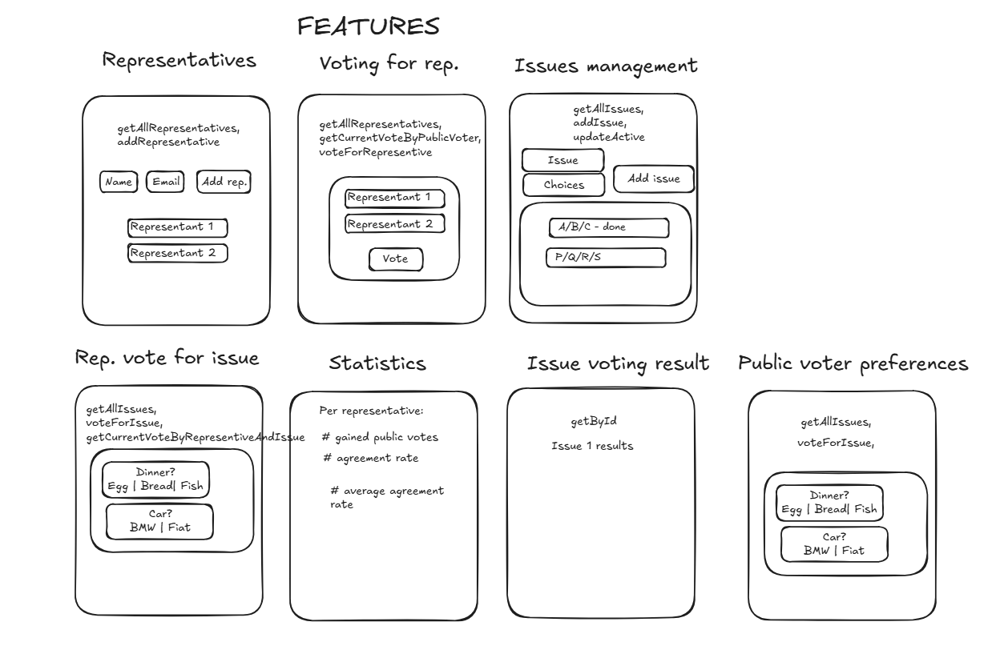

# Final assignment v2.2

You will build a voting application to visualize the impact of your vote in a representative democracy.

The challenge will focus on code quality and how to vertically slice your features.

Seeding relevant data will also be of importance.

## Background

You will build an app for a representative democracy where a crowd of public voters will be represented by a smaller group of professional representative voters.

The representative voters will place all their public votes they have gained when voting on a choice in an election.

An election will have multiple choices to vote on, and the choice with most public votes win.

The app should help us understand how well the public voters agrees with their representative by providing useful statistics.

---

## Big picture plan

